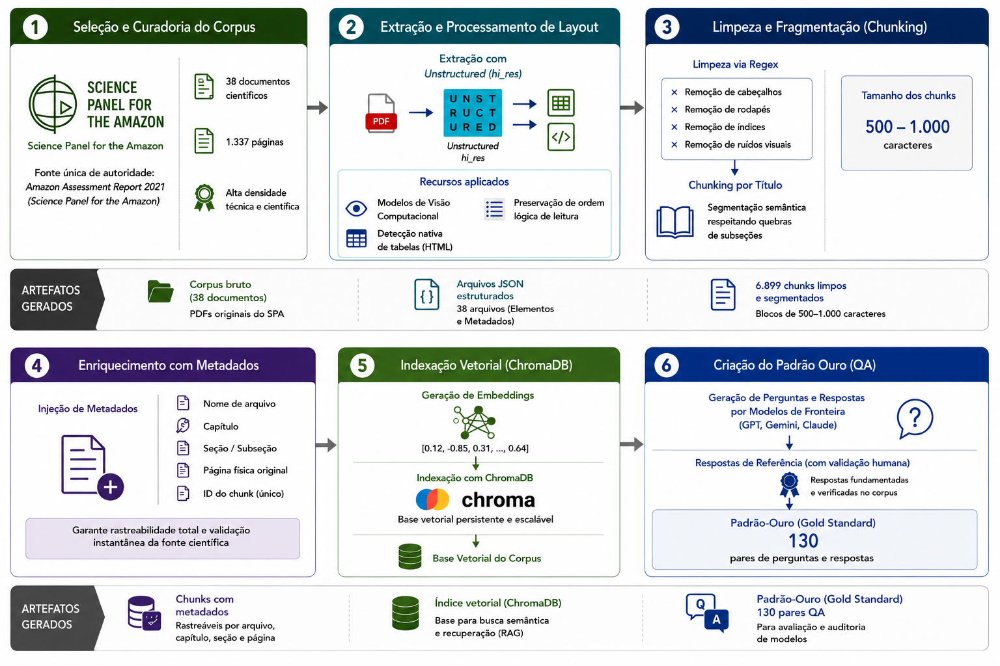
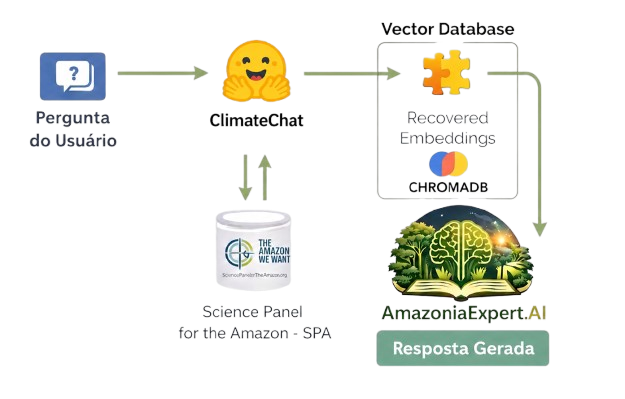

<div align="center">

# 🌿 SPAmazon-QA

### Benchmarking de LLMs na Amazônia Sustentável com RAG

[](https://www.python.org/downloads/)
[](https://opensource.org/licenses/MIT)
[](https://www.trychroma.com/)
[](https://huggingface.co/sentence-transformers/all-mpnet-base-v2)

</div>

---

## Visão Geral

O **SPAmazon-QA** é um benchmark científico desenvolvido para avaliar modelos de linguagem (LLMs) no domínio da **Amazônia Sustentável**, utilizando uma arquitetura baseada em **RAG (*Retrieval-Augmented Generation*)**.

A base de conhecimento é fundamentada nos relatórios do **Science Panel for the Amazon (SPA)** — a única fonte de autoridade científica do projeto.

### Objetivos

| Objetivo | Descrição |
|---|---|
| 🧠 Reduzir alucinações | Respostas ancoradas em corpus científico verificado |
| 🔍 Rastreabilidade | Cada resposta vinculada à fonte original |
| 📊 Avaliação semântica | Métricas quantitativas e qualitativas |
| 🏆 Padrão-ouro | Benchmark estruturado com 130 pares QA |

---

## Pipeline Metodológico

<p align="center">
  
</p>

O pipeline é composto por **6 etapas sequenciais**, desde a curadoria do corpus até a criação do padrão-ouro:

1. **Seleção e Curadoria** — 38 documentos científicos, 1.337 páginas do SPA
2. **Extração com Unstructured** — preservação de tabelas, layouts e múltiplas colunas
3. **Limpeza e Chunking** — regex + segmentação semântica em blocos de 500–1.000 caracteres → 6.899 chunks
4. **Enriquecimento com Metadados** — capítulo, seção, página e ID único por chunk
5. **Indexação Vetorial** — embeddings `all-mpnet-base-v2` indexados no ChromaDB
6. **Criação do Padrão-Ouro** — 130 pares QA gerados e validados por humanos

---

## Arquitetura RAG

<p align="center">
  
</p>

---

## Estrutura do Repositório

```
SPAmazon-QA/
│
├── PAR QA/
│   ├── gold_standard_amazonia.json   # Dataset padrão-ouro (130 pares QA)
│   ├── gerar_json.py                 # Script de geração do benchmark
│   └── titulos.txt                   # Metadados auxiliares
│
├── RAG/
    ├── PDFs/                         # Relatórios originais do SPA (PDF)
│   ├── Dados_Limpos/                 # Corpus extraído, tratado e enriquecido (JSON)
│   ├── Dados_Tratados_CC/            # Corpus dos Cross Chapters (JSON)
    ├── VECTOR_DB/                    # Banco vetorial gerado automaticamente
    ├── MODELO/                       # Modelos GGUF locais (não versionados)
│   │
│   ├── app.py                        # Interface / execução principal
│   ├── main.py                       # Processa o corpus
│   ├── mainCross.py                  # Execução cross-model
│   ├── vetorizacao.py                # Banco vetorial gerado automaticamente (não versionado)
│   ├── teste_busca.py                # Testes de recuperação
│   └── auditoria.py                  # Auditoria das respostas
│
├── assets/
│   ├── fluxograma_datasetdivido.png  # Fluxograma metodológico
│   └── RAG_climate.png               # Arquitetura RAG
│
└── README.md
```

---

## Benchmark — Gold Standard

**Localização:** `PAR QA/gold_standard_amazonia.json`

### Estrutura de cada entrada

```json

{
  "id_questao": Y,
  "metadados_pergunta": {
    "capitulo_alvo": "Chapter X",
    "dificuldade": "Easy | Medium | Hard",
    "tipo": "Direct | Indirect",
    "modelo_gerador_qa": "Modelo utilizado para geração do QA",
    "indice_subjetividade_textblob": 0.0
  },

  "padrao_ouro": {
    "pergunta": "Pergunta de referência",
    "resposta_esperada": "Resposta científica esperada"
  },

  "avaliacoes_modelos": [
    {
      "modelo_avaliado": "Nome do modelo",

      "resposta_gerada": "Resposta produzida pelo modelo",

      "juiz_llm": {
        "nota_likert": 0,
        "justificativa_tecnica": "Análise técnica da resposta"
      },

      "similaridade_faiss_percentual": 0.0
    }
  ]
}
```

### Modelos avaliados

`GPT-4` · `Claude 3.5` · `Gemini 2.5` · `LLaMA 3` · `AmazoniaExpert`

---


## Modelos Utilizados

Os modelos utilizados no projeto são carregados localmente no formato GGUF via `llama.cpp`.

Devido ao tamanho dos arquivos, os modelos **não são versionados no GitHub**.

### Estrutura esperada

```text
RAG/
├── MODELO/
│   ├── ClimateChat.i1-Q4_K_M.gguf
│   └── Meta-Llama-3-8B-Instruct.Q4_K_M.gguf
```

### Download dos modelos

| Modelo | Link |
|---|---|
| ClimateChat (GGUF) | https://huggingface.co/mradermacher/ClimateChat-i1-GGUF/blob/main/ClimateChat.i1-Q4_K_M.gguf |
| Meta-Llama-3-8B-Instruct (GGUF) | https://huggingface.co/QuantFactory/Meta-Llama-3-8B-Instruct-GGUF/blob/main/Meta-Llama-3-8B-Instruct.Q4_K_M.gguf |

Após o download, mova os arquivos `.gguf` para:

```text
RAG/MODELO/
```

Os modelos são distribuídos por terceiros via Hugging Face e mantêm suas respectivas licenças originais.
O projeto SPAmazon-QA não redistribui pesos proprietários ou arquivos GGUF.


## Como Usar

### 1. Clonar o repositório

```bash
git clone https://github.com/seu-usuario/SPAmazon-QA.git
cd SPAmazon-QA
```

---

### 2. Instalar dependências

```bash
pip install -r requirements.txt
```

### Dependência adicional para CPU (GGUF / llama.cpp)

```bash
pip install llama-cpp-python --extra-index-url https://abetlen.github.io/llama-cpp-python/whl/cpu
```

---

### 3. Configurar ambiente

Crie um arquivo `.env` na raiz do projeto:

```env
UNSTRUCTURED_API_KEY=sua_chave_aqui
```

A chave pode ser obtida em:
https://unstructured.io/

---

### 4. Processar os PDFs científicos

Os PDFs do SPA devem estar em:

```text
RAG/PDFs/
```

Execute:

```bash
python RAG/main.py
```

Isso irá:
- extrair os documentos;
- limpar ruídos;
- gerar chunks semânticos;
- enriquecer metadados;
- salvar os JSONs processados.

---

### 5. Criar a base vetorial (ChromaDB)

```bash
python RAG/vetorizacao.py
```

Isso irá:
- gerar embeddings `all-mpnet-base-v2`;
- indexar os chunks;
- criar a base vetorial persistente em `RAG/VECTOR_DB/`.

---

### 6. Testar recuperação semântica

```bash
python RAG/teste_busca.py
```

---

### 7. Carregar o benchmark

```python
import json

with open('PAR QA/gold_standard_amazonia.json', 'r', encoding='utf-8') as f:
    data = json.load(f)

print(data[0]['padrao_ouro']['pergunta'])
```

---

## Aplicações

- Avaliação de LLMs especializados em domínio científico
- Pesquisa em RAG e recuperação semântica
- Auditoria e rastreabilidade de respostas de IA
- NLP aplicado à Amazônia e sustentabilidade
- Sistemas de QA com contexto científico

---

## Diferenciais

- ✅ Base científica confiável (Science Panel for the Amazon)
- ✅ Benchmark estruturado com 130 pares QA validados
- ✅ Avaliação multimodelo (GPT-4, Claude, Gemini, LLaMA)
- ✅ Métricas quantitativas + qualitativas
- ✅ Pipeline RAG completo e reprodutível
- ✅ Rastreabilidade total até a fonte original

---

## Autoria

**Ana Clara Guerra**
Pesquisa em Inteligência Artificial aplicada à Amazônia Sustentável

---

## Licença

Este projeto está sob a licença [MIT](https://opensource.org/licenses/MIT).

---

## Contribuição

Pull requests são bem-vindos!
Para mudanças maiores, abra uma issue primeiro para discutir o que você gostaria de alterar.
